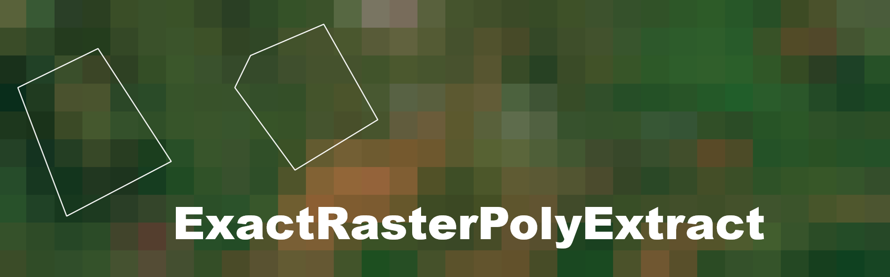

# ExactRasterPolyExtract
A wrapper for the `exact_extract` function for polygon-based raster extraction.

ExactRasterPolyExtract is a wrapper for the Python binding of the [exact_extract](https://isciences.github.io/exactextract/) function. `exact_extract` conveniently provides the coverage fraction of each pixel that is covered by a polygon, enabling e.g. subset extraction by coverage fraction. 
The wrapper `exact_raster_poly_extract` provides a simple interface to `exact_extract`, allowing users to extract pixel values and coverage fractions from raster datasets using polygon geometries. The output is formatted to be suitable as input for ML tasks. 

**Details:**  
`exact_extract` returns a pandas dataframe of shape: (polygons) x (bands + columns), where each value cell contains a 1D array (pd.Series) of pixel values. The length of said array varies with the number of pixels covered by the polygon.

In `exact_raster_poly_extract`, we transform this into a pandas DataFrame with the shape: (**pixels**) x (bands + polygon ID + columns).

## Installation
```bash
pip install git+https://github.com/leleist/exactrasterpolyextract.git
```

## Usage
```python
from exactrasterpolyextract import exact_raster_poly_extract

# reference to raster file
raster_path = 'path/to/raster.tif'

# reference to polygon file (shapefile)
polygon_path = 'path/to/polygon.shp'

# define the columns to keep from the polygon file during extraction
include_columns = ['column1', 'column2'] # e.g. ['id', 'class']

# extract pixelvalues and coverage fractions

output = exact_raster_poly_extract(raster_path, polygon_path, include_columns, progress=True)
```

## Contributions
The package will continue to be developed as needed.

Any contributions are welcome.

Current ToDos:  
- add polygon pixel ID to output
- find more efficient way to explode the initial PD df output.

## Acknowledgments

This package is a wrapper for the `exact_extract` function. 
Its development was supported by NASA, U.S. Army Engineer Research and Development Center (ERDC) and ISciences, LLC and is used under the Apache License 2.0.

If you use this package, please cite: 
  - the **original authors**
  - Leist, Leander (2025). ExactRasterPolyExtract: A wrapper for the exact_extract function for polygon-based raster extraction, Laboratory for Climatology and Remote Sensing (LCRS), University of Marburg, Germany, GitHub. https://github.com/leleist/exactrasterpolyextract

## License
Licensed under the Apache License, Version 2.0 [See](./LICENSE);
you may not use this file except in compliance with the License.  
You may obtain a copy of the License at [ http://www.apache.org/licenses/LICENSE-2.0 ](http://www.apache.org/licenses/LICENSE-2.0)

Unless required by applicable law or agreed to in writing, software
distributed under the License is distributed on an "AS IS" BASIS,
WITHOUT WARRANTIES OR CONDITIONS OF ANY KIND, either express or implied.
See the License for the specific language governing permissions and
limitations under the License.